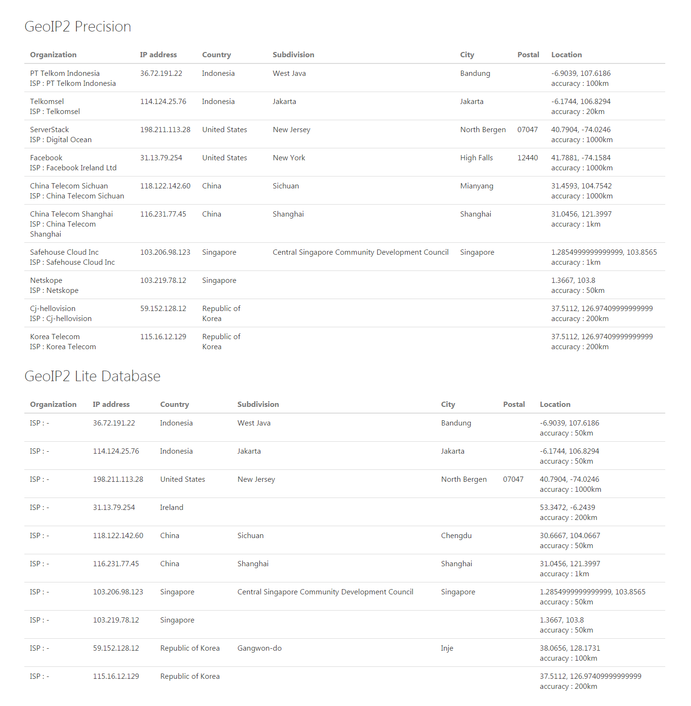

# geoip2-servlet
GeoIP2 Java API implementation in servlet, for API documentation please read here http://maxmind.github.io/GeoIP2-java/

### GeoIP2 account and license configuration
Put your userId and licenseKey of GeoIP2 account in `webapp/resources/config-dev.properties`
 
### List of IP(s) you want to inspect
Put yout list of IP you want to inspect in `webapp/resources/ipAddress.csv`

### How to run the project?
- Open eclipse
- Right click on project >> Run As >> Maven Install
- Right click on project >> Run As >> Run on Server   

### Screenshot

